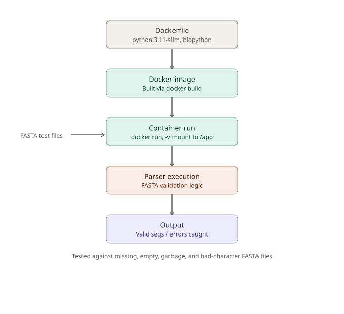

# BIOINFORMATICS
## Architecture 

## METABRIC Breast Cancer Subtype Classification

## Goal
Predict breast cancer molecular subtype (`3-gene_classifier_subtype`) from clinical and 
pathological features using a machine learning classifier.

## Dataset
- METABRIC clinical dataset — 1700 patients (after removing ~204 rows with unknown subtype 
  labels), 4 target classes: ER+/HER2- High Prolif, ER+/HER2- Low Prolif, ER-/HER2-, HER2+
- Data available via cBioPortal (not included in this repo)
- 9 features used: age at diagnosis, tumor size, histologic grade, lymph nodes positive, 
  mutation count, Nottingham Prognostic Index, tumor stage, menopausal state, PR status
- Features were selected to exclude label-defining columns (ER/HER2/PAM50/integrative cluster), 
  post-hoc treatment data, and future-outcome data (survival/death), to avoid leakage

## Approach
- RandomForestClassifier (scikit-learn), `stratify=y` on an 80/20 train/test split due to class 
  imbalance (HER2+ = 188 of 1700 rows)

## Results
Overall accuracy: **0.51**

**Limitation — HER2+ subtype classification:** The model achieves 0.51 overall accuracy but only 0.18 recall on the HER2+ subtype. Class-weighting strategies (`balanced`, `balanced_subsample`) were tested and did not improve this, and confusion matrix analysis showed HER2+ misclassifications scattered across all other classes rather than concentrated in one — indicating a feature-availability limitation rather than a class-imbalance or training issue. This is consistent with HER2 status being driven by a specific molecular event (HER2 gene amplification) that isn't captured by the clinical/pathological features used here (tumor size, grade, stage, etc.). Reliable HER2+ classification would likely require molecular-level features such as HER2 IHC/FISH scores.

## Tools
Python, pandas, scikit-learn