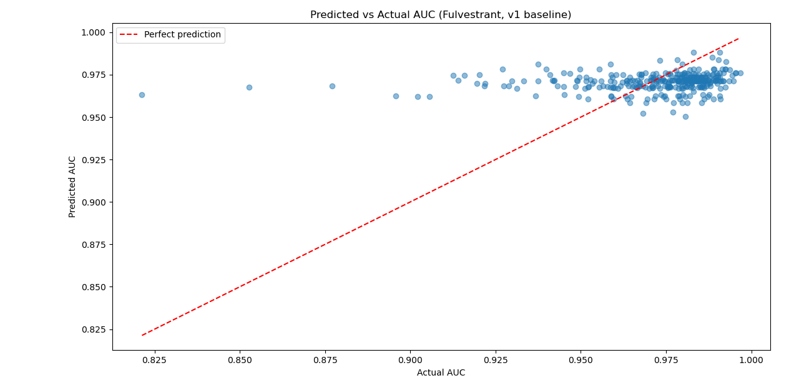

# Predicting Fulvestrant Sensitivity in Cancer Cell Lines (GDSC2 baseline)

A baseline machine-learning model that tries to predict how sensitive cancer cell lines are to the drug Fulvestrant, using cancer type and molecular-data availability flags from the GDSC2 dataset.

**Short result:** the model is only marginally better than predicting the average (R² 0.017). The main finding is a data-quality one: the CNA, Gene Expression and Methylation columns are Y/N availability flags, not measured values, so the model had no real molecular signal to learn from.

Full write-up: [`Fulvestrant_GDSC_Baseline_Report_v1.pdf`](../Docs/Fulvestrant_GDSC_Baseline_Report_v1.pdf)

## Question

Can the sensitivity (measured as AUC) of Fulvestrant be predicted for GDSC2 cell lines from molecular-data availability and cancer-type metadata? Lower AUC means higher sensitivity.

## Data

- GDSC2 (Genomics of Drug Sensitivity in Cancer, Wellcome Sanger Institute), hosted on Kaggle: 242,035 rows.
- Filtered to Fulvestrant: 1,680 rows.
- The dataset is **not included** in this repository. Download it and save it as `GDSC_DATASET.csv` next to `gdsc.py`.

## Method

1. **Cleaning:** the same 65 rows were missing CNA, Gene Expression and Methylation and were dropped (1,680 to 1,615 rows). MSI nulls (19) were kept as an "Unknown" category.
2. **Cancer type:** 294 missing values (about 18%) kept as "Unknown". Types with fewer than 20 cell lines (74 cell lines in total) were merged into "Other", reducing 32 categories to 26.
3. **Features:** CNA, Gene Expression, Methylation, MSI and Cancer Type, one-hot encoded (35 columns).
4. **Leakage exclusions:** AUC, LN_IC50 and Z_SCORE (response-derived), DRUG_ID, DRUG_NAME, TARGET and TARGET_PATHWAY (constant after filtering), and COSMIC_ID and CELL_LINE_NAME (identifiers).
5. **Target:** AUC.
6. **Model:** `RandomForestRegressor(random_state=42)`, 80/20 train/test split (1,292 train, 323 test), `random_state=42`.
7. **Baseline for comparison:** scikit-learn `DummyRegressor` (predicts the training-set mean).

## Results

| Model | R² | MSE |
|---|---|---|
| Mean-predictor baseline | -0.001 | 0.000457 |
| Random Forest Regressor | 0.017 | 0.000448 |



- The Random Forest lowers MSE by about 2% compared with the mean baseline. On a single 20% test split this cannot be distinguished from noise.
- Top feature: `Cancer Type_BRCA` (importance 0.145, about 1.8x the next highest). Among the five largest cancer-type groups, BRCA had the lowest mean AUC and the widest spread, which is compatible with Fulvestrant's ER-targeted use, but mean AUC differences between cancer types were small, so this is a hint rather than a confirmation.
- Predicted AUC was squeezed into a narrow band (about 0.96 to 0.98) while actual AUC spanned about 0.82 to 1.0, so the model cannot separate sensitive from resistant cell lines.

## Limitations

- Feature granularity: CNA, Gene Expression and Methylation are availability flags, not measurements.
- Only five features were available.
- Single drug (Fulvestrant); not validated on other drugs.
- Weak explanatory power: not suitable for real predictive use. It is a proof-of-concept and diagnostic exercise.
- About 18% of cancer types are "Unknown", which may dilute any signal cancer type carries.
- Single train/test split, no cross-validation, no hyperparameter tuning, no other models tested.

## Future work

- Run the same pipeline for Oxaliplatin.
- Use real GDSC omics matrices (actual expression, copy number and methylation values).
- Add cross-validation to check how stable the R² is.
- Compare against Linear Regression.
- Consider CCLE as an additional dataset.

## How to run

```bash
pip install pandas scikit-learn matplotlib
python gdsc.py
```

The script prints the cleaning checks, the model and baseline scores, and the top feature importances, then opens a predicted-vs-actual AUC plot.

## Files

- `gdsc.py`: cleaning, modeling and evaluation.
- `README.md`: this file.
- Report PDF: in `Docs/` at the repository root.